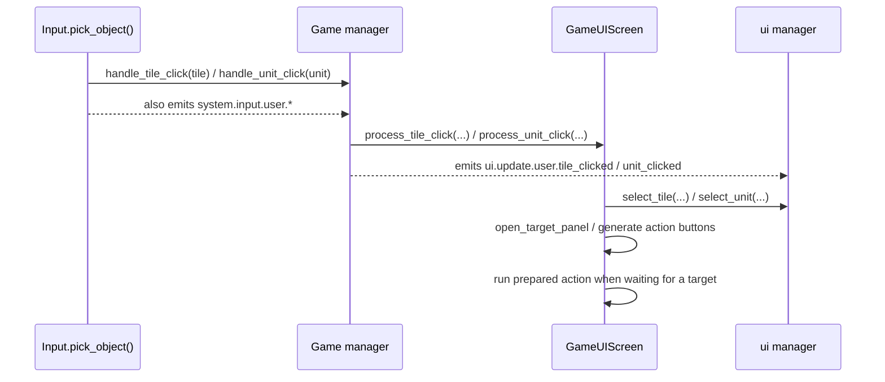

# UI Runtime

> Back to [Documentation Index](../INDEX.md)
>
> Related: [Startup Flow](startup.md) | [Architecture](architecture.md) | [Signals](signals.md) | [Actions](actions.md)

This document covers the live Kivy runtime after bootstrap: the screen registry, the manager/screen ownership split, the in-session `GameUIScreen` contract, and the current popup/input-lock policy.

It describes the current implementation rather than an idealized future architecture.

## Screen graph

```mermaid
flowchart TD
    Ready[system.main.ready] --> MainReady[ui.on_main_ready()]
    MainReady --> MainMenu[main_menu]

    MainMenu -->|New Game| Config[game_config_screen]
    MainMenu -->|Load| SaveLoad[save_load_screen]
    MainMenu -->|Debug Quick Start| StartSignal[system.game.start_load]

    Config --> StartSignal
    StartSignal --> GameStart[Game.on_game_start()]
    GameStart --> LoadingSignal[ui.request.loading_screen]
    LoadingSignal --> Loading[loading_screen]
    GameStart --> DelayedStart[Game._try_game_start()]
    DelayedStart --> TrueStart[game.state.true_game_start]
    TrueStart --> UIPost[ui.post_game_start()]
    TrueStart --> ScreenStart[GameUIScreen.on_game_start()]
    UIPost --> GameUI[game_ui]
    ScreenStart --> GameUI

    SaveLoad -->|LoadPopup -> game.state.request_load| LoadGame[Game.load()]
    LoadGame --> LoadFinished[game.state.load_finished]
    LoadFinished --> ScreenStart
```

## Screen registry

`SCivGUI.build()` registers the runtime screens once and keeps the `ScreenManager` alive for the whole app session.

| Screen name | Class | Purpose |
| --- | --- | --- |
| `main_menu` | `MainMenuScreen` | First live screen after `system.main.ready`; offers new game, load, options, source link, and quit. |
| `game_config_screen` | `GameConfigMenu` | Collects map size, player civilization/leader picks, boolean options, and rules before starting a new game. |
| `loading_screen` | `Loading` | Shows civilization flavor text and loading progress/continue UI while a new game is being prepared. |
| `game_ui` | `GameUIScreen` | Main in-session HUD: action bar, turn controls, top bar, city UI, targeting panels, logs, and fullscreen overlays. |
| `options_screen` | `OptionsScreen` | Registered in the screen manager, but outside the main gameplay/UI-runtime contract documented here. |
| `pause_menu` | `PauseScreen` wrapping `PauseMenu` | Screen-backed popup for the escape menu. |
| `save_load_screen` | `SaveLoadScreen` | Thin host screen that opens `SavePopup` and `LoadPopup`. |

## Ownership boundaries

### `SCivGUI` owns screen registration and coarse screen swaps

`sciv/menus/kivy/core.py` is the Kivy app host.

Its responsibilities are intentionally narrow:

- build the `ScreenManager`
- create the long-lived `game_ui` screen instance
- switch between named screens
- activate the loading screen with civilization-specific art
- reset the `game_ui` screen between sessions

`SCivGUI.reset()` is worth remembering: it removes and recreates only the `game_ui` screen. The other screens remain registered.

### `ui` owns cross-screen state and selection state

The `ui` singleton in `sciv/managers/ui.py` is the bridge between gameplay/runtime events and the Kivy screen layer.

It owns:

- the `SCivGUI` instance after `kivy_setup()`
- currently selected tile/unit bookkeeping
- popup bookkeeping in `self.popups`
- the previous screen name used when returning from save/load
- post-game-start handoff from the manager layer into `GameUIScreen`
- notification refreshes tied to turn and research events

It also performs the first live screen change after startup:

- `OpenCiv.on_loading_screen_continue()` emits `system.main.ready`
- `ui.on_main_ready()` responds by switching to `main_menu`

### `GameUIScreen` owns the in-session HUD

`GameUIScreen` is the real runtime UI hub once a game exists.

Its contract splits into two phases:

1. **Screen registration phase** — `SCivGUI.build()` creates the screen object and registers it with the `ScreenManager`.
2. **Session activation phase** — `ui.post_game_start()` and `GameUIScreen.on_game_start()` build the widgets that require a live player/world.

In practice, `GameUIScreen` owns:

- action staging and deferred action execution
- target panels and duel panels
- city UI opening/closing
- research, civics, inspect, debug-actions, and log overlays
- top bar, player list, combat log, and messenger widgets
- unit-path preview rendering
- input locking for fullscreen/modal gameplay overlays

### `GameConfigMenu` owns new-game payload assembly

`GameConfigMenu` is the main pregame contract.

When the user starts a game, it assembles:

- map size
- per-player civilization and leader choices
- simple boolean options such as developer mode / barbarians / teams
- current editable `GameRules` values
- a `start_config` payload containing `options`, `rules`, and `players`

It then schedules `system.game.start_load` with:

- `size`
- the local player's civilization class
- the player count
- `start_config`

The debug-only quick-start path in `MainMenuScreen` emits the same start signal directly, but without the richer `start_config` payload.

## New-game and load handoff

### New game

The current new-game path is:

1. `MainMenuScreen` or `GameConfigMenu` emits `system.game.start_load`.
2. `Game.on_game_start()` records the requested settings and emits `ui.request.loading_screen`.
3. `SCivGUI.activate_loading_screen()` switches to `loading_screen` and optionally sets the chosen civilization artwork/text.
4. `Game.on_game_start()` schedules `_try_game_start()` after a short delay so the loading screen can become visible.
5. `Game._try_game_start()` generates the world, activates turns/input/camera, and emits `game.state.true_game_start`.
6. `ui.post_game_start()` binds the live `Game` / `World`, sets the session player on `game_ui`, builds the screen root, refreshes the messenger, and initializes notifications.
7. `GameUIScreen.on_game_start()` builds the player list, combat log, top bar, and related runtime widgets.

### Load game

The current load path is:

1. `MainMenuScreen` or `PauseMenu` requests `ui.update.ui.show_load`.
2. `ui.on_show_load()` switches to `save_load_screen` and opens `LoadPopup`.
3. `LoadPopup` emits `game.state.request_load`.
4. `Game.load()` reconstructs entities, world state, render state, and turn state, then switches back to `game_ui`.
5. `Game.load()` calls `ui.post_game_start()`, resets the game UI, and emits `game.state.load_finished`.
6. `GameUIScreen.on_game_start()` listens to `game.state.load_finished` as well as `game.state.true_game_start`.

## Interaction flow

### Click flow



The important ownership split is:

- `Input` performs Panda3D picking.
- `Game` is the bridge from picked world objects into the UI layer.
- `GameUIScreen` decides how the active HUD should react.
- `ui` owns the durable selected tile/unit references.

### Hover flow

Hover messages take a similar route, but currently end in lightweight bridge methods:

- `Input` emits `system.input.user.tile_hovered` and `system.input.user.tile_unhovered`
- `Game` forwards them to `ui.update.user.tile_hover` and `ui.update.user.tile_unhover`
- `ui.on_tile_hover()` / `ui.on_tile_unhover()` currently exist as placeholders

That means hover routing is wired, but the manager-side handlers are effectively no-ops right now.

## Overlay and input-lock policy

There are two different input-protection mechanisms in the current runtime. They solve different problems.

### 1) Geometry-based world-picking suppression

`CollisionPreventionMixin` in `sciv/menus/kivy/mixins/collidable.py` polls mouse position and cached Kivy widget bounds.

Widgets registered with `register_non_collidable()` are treated as UI that should block world picking when the mouse is over them. The mixin mainly toggles:

- `system.input.raycaster_off`
- `system.input.raycaster_on`

If a widget was created with `disable_zoom=True`, the mixin can also toggle camera zoom signals.

This is used for HUD elements that should coexist with the live world rather than hard-pausing it.

### 2) Explicit modal/fullscreen lock

`GameUIScreen.lock_input()` / `unlock_input()` and the save/load popups use a stronger lock by sending:

- `system.input.raycaster_off` / `system.input.raycaster_on`
- `system.input.disable_zoom` / `system.input.enable_zoom`
- `system.input.disable_control` / `system.input.enable_control`
- `system.input.camera_lock` / `system.input.camera_unlock`

This is used for overlays that should temporarily stop normal map interaction.

### Which overlays use which lock?

| UI element | Current behavior |
| --- | --- |
| Action bar / turn control / player list / combat log / popup layouts | Registered as non-collidable so hovering them disables world picking. |
| Research / civics / inspect / debug actions / log | Open inside `GameUIScreen` and call `lock_input()` until closed. |
| SavePopup / LoadPopup | Open from `save_load_screen`, register themselves as non-collidable, bind `escape`, and explicitly disable zoom/control plus camera movement. |
| Pause menu | Opens via `ui.update.ui.show_pause` and uses collision-prevention for the popup container, but the active flow does not itself toggle `Game.pause()`. |
| Age popup / simple modal popups | Open as Kivy popups; they participate in the popup/UI layer but are not the main place where gameplay input locking is coordinated. |

## Current implementation notes

- `ui.post_game_start()` is currently invoked in two ways on the new-game path: as a listener for `game.state.true_game_start` and as a direct call from `Game._try_game_start()`. Keep post-start work idempotent when modifying it.
- The load path also performs direct `ui.post_game_start()` work before `game.state.load_finished` reaches `GameUIScreen`.
- The active escape-menu flow is `GameUIScreen.on_escape()` -> `ui.update.ui.show_pause` -> `PauseMenu.open()`. The older `ui.get_escape_menu()` helper still exists and does call `Game.pause()/unpause()`, but it is not the current screen-driven pause path.
- `SavePopup.close_popup()` returns to `game_ui` by calling `ui.manager.set_screen("game_ui")`, while `LoadPopup.close_popup()` emits `ui.update.ui.hide_load` and lets the UI manager restore the previous screen. Similar surfaces, slightly different exit paths.
- `MainMenuScreen.continue` is present but currently disabled.
- The debug quick-start button bypasses most of `GameConfigMenu` and goes straight to `system.game.start_load`.

## Files to inspect when changing UI runtime

- `sciv/game.py`
- `sciv/managers/game.py`
- `sciv/managers/ui.py`
- `sciv/menus/kivy/core.py`
- `sciv/menus/kivy/mixins/collidable.py`
- `sciv/menus/kivy/elements/popup.py`
- `sciv/menus/screens/main_menu.py`
- `sciv/menus/screens/game_config.py`
- `sciv/menus/screens/loading.py`
- `sciv/menus/screens/game_ui.py`
- `sciv/menus/screens/pause_menu.py`
- `sciv/menus/screens/save_load.py`