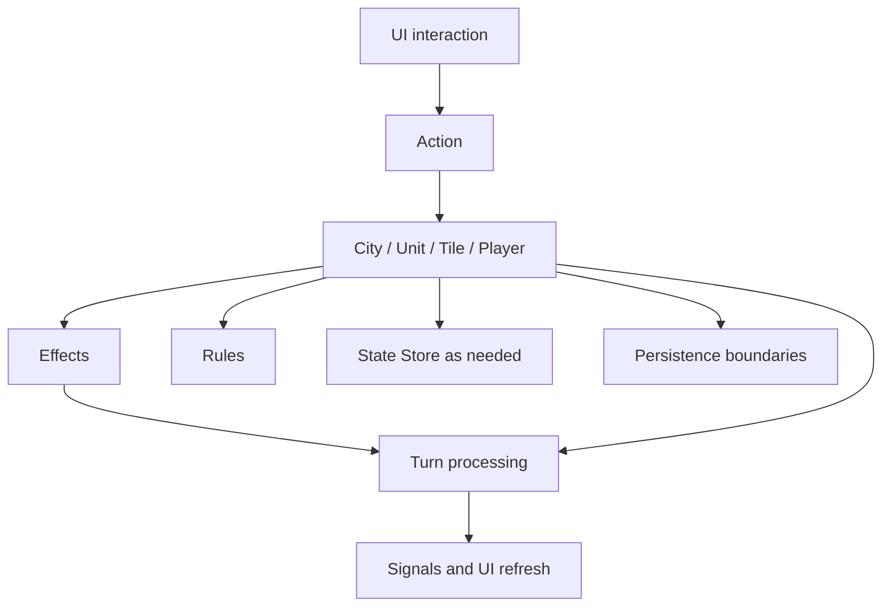

# Workings

> Back to [Documentation Index](../INDEX.md)
>
> Related: [Architecture](architecture.md) | [Entities and Save/Load](entities.md) | [Turn Processing](turns.md) | [Rules](rules.md)
>
> This file is now a mechanics overview and hub. Focused deep dives live in separate pages so that gameplay behavior can be documented in more depth without turning one file into a junk drawer.

## Mechanics map

| Topic | Read when | Focused doc |
| --- | --- | --- |
| Rules | You need the rule registry or configurable values | [Rules](rules.md) |
| Tile system | You are working on tile ownership, occupancy, terrain/resource/improvement state, or tile pathing/render hooks | [Tile System](tile-system.md) |
| Vision and fog | You are working on gameplay visibility, explored state, lingering fog, or player-collected sight emitters | [Vision and Fog of War](vision-fog.md) |
| Effects | You are working on persistent modifiers, timed bonuses, or effect placement | [Effects](effects.md) |
| Actions | You are working on one-shot gameplay operations or action-bar behavior | [Actions](actions.md) |
| City production and growth | You are working on food, production, border growth, or city build flow | [City Production and Growth](city-production.md) |
| Non-entity runtime state | You are working on `managers/state.py` or shared non-entity state | [State Store](state.md) |

## How these systems fit together

## High-level guidance

### Use actions for immediate intent

If the behavior is a one-off command or UI-driven operation, start with [Actions](actions.md).

### Use tile-system docs for tile ownership and occupancy

If the change starts from `Tile`, `World`, or `TileRepository`, or if it changes the boundary between tile state and tile rendering, start with [Tile System](tile-system.md).

### Use effects for persistent modifiers

If the behavior should remain attached to a tile, city, player, unit, improvement, or the world over time, start with [Effects](effects.md).

### Use the vision doc for gameplay-owned visibility

If the change starts from player sight, fog-of-war state, city/unit visibility emitters, or render consumers of visibility, start with [Vision and Fog of War](vision-fog.md).

### Use city production docs for economy-side turn work

Food growth, border expansion, and active city builds all live together in the city turn pass. Start with [City Production and Growth](city-production.md) when touching that area.

### Keep non-entity runtime state explicit

If a mechanic needs shared state outside the entity graph, review [State Store](state.md) and [Entities and Save/Load](entities.md) before deciding where it belongs.

## When to split further

If one of the focused docs grows to cover multiple independent systems again, split it instead of reintroducing a catch-all page. The goal is:

- overview in `workings.md`
- depth in focused docs
- durable routing from the index and instruction layer
